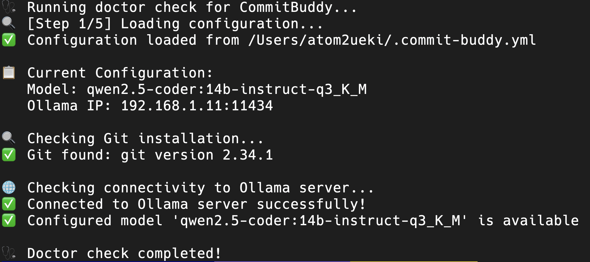
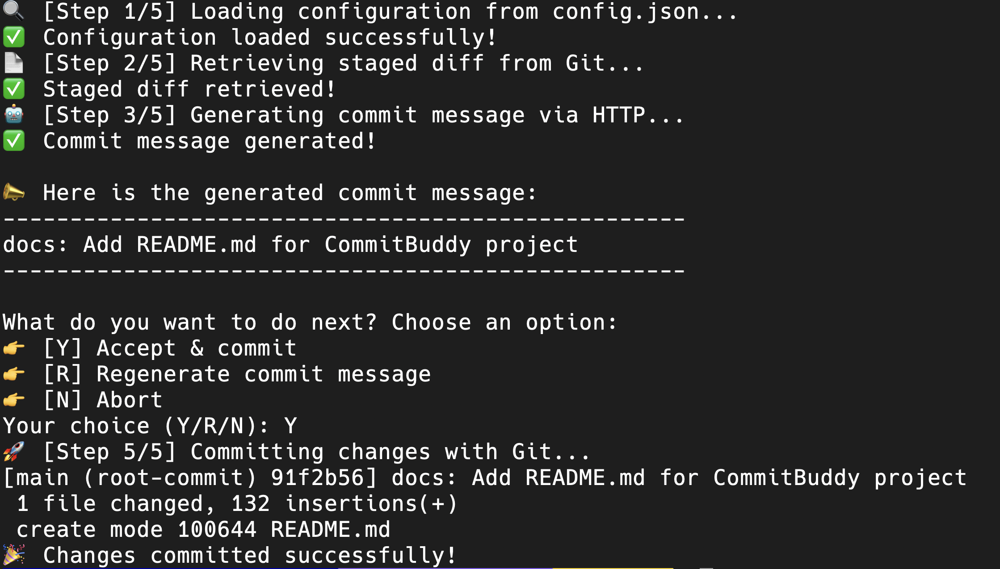

# CommitBuddy - Your AI-Powered Git Commit Assistant

CommitBuddy is a command-line tool that generates semantic commit messages using an AI assistant powered by the Ollama CLI. With a fun, interactive, and step-by-step process, CommitBuddy helps you craft clear, conventional commit messages while adding a bit of humor to your Git workflow.

## Preview

```bash
commitbuddy doctor
```



```bash
commitbuddy generate
```



## Features

- **Step-by-Step Process:**  
  Follow along as CommitBuddy loads your configuration, retrieves staged changes, generates an AI-powered commit message, and (optionally) commits the changes—all with fun emojis and informative messages.

- **Interactive Options:**  
  After generating a commit message, choose from:
  - **Y**: Accept & commit the changes.
  - **R**: Regenerate a new commit message.
  - **N**: Abort the commit process.

- **Diagnostic Check:**  
  The `doctor` command verifies your configuration, confirms Git installation, and tests connectivity to your Ollama server.

## Requirements

- Python 3.6 or higher
- [Git](https://git-scm.com/) (your project must be under Git version control)
- [Ollama](https://ollama.ai/) installed and running

## Installation

### For Users

```bash
# Install from PyPI
pip install commit-buddy
```

### For Developers

If you want to contribute or modify the code:

```bash
# Clone the repository
git clone https://github.com/atom2ueki/commitbuddy
cd commitbuddy

# Install in editable mode for development
pip install -e .
```

## Configuration

CommitBuddy can be configured using a `.commit-buddy.yml` file. The configuration file is searched for in the following locations (in order of priority):

1. Current directory: `./.commit-buddy.yml`
2. Home directory: `~/.commit-buddy.yml`
3. XDG config directory: `~/.config/commit-buddy/config.yml`

### Example Configuration

Create a `.commit-buddy.yml` file in your home directory or project directory:

```yaml
# Model configuration
model: qwen:14b              # The Ollama model to use
ollamaIp: localhost:11434    # Ollama server address
```

If no configuration file is found, CommitBuddy will use these default settings.

## Usage

### Generate a Commit Message

```bash
commitbuddy generate
```

When you run this command, you'll see progress messages like:

- **Step 1/5:** Loading configuration (🔍)
- **Step 2/5:** Retrieving staged changes (📄)
- **Step 3/5:** Generating commit message with AI assistance (🤖)
- **Step 5/5:** Committing changes (🚀)

After the commit message is generated, you'll be prompted:

```
What do you want to do next? Choose an option:
👉 [Y] Accept & commit
👉 [R] Regenerate commit message
👉 [N] Abort
Your choice (Y/R/N):
```

### Run Diagnostic Check

To verify your setup and configuration:

```bash
commitbuddy doctor
```

This will check:
- Configuration status and location
- Git installation
- Ollama server connectivity
- Model availability

## License

This project is licensed under the [MIT License](LICENSE).

## Contributing

Contributions are welcome! Please feel free to submit a Pull Request.

---

Enjoy your interactive, AI-powered commit message generator—**CommitBuddy**! 🚀😄
